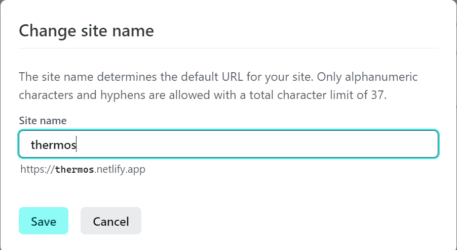
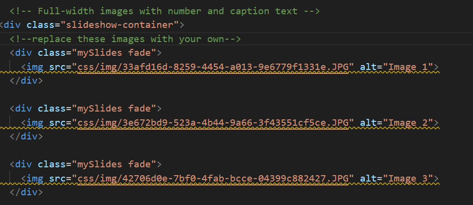
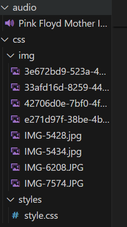

# Mother's Day Template 🌸

A template to present a mother figure with their own web page. 😊

## Installation

1. Clone the repository:

   ```bash
   git clone https://github.com/kuriofoolio/mothers_day_template.git
   ```

2. Navigate to the project directory:

   ```bash
   cd project
   ```

3. Start the application:

   open index.html in your browser

4. Customize images and audio  
[Refer to Customizations](#Customizations)


5. Upload project to Netlify  
Customize your domain name (use something obscure other than "mother's day" to avoid spoiling the surprise) 🙈


## Customizations

The index page contains an animated Mother's Day envelope.   
The slideshow page contains a slideshow of customizable images of you and your mother figure.   
The background music is an instrumental of "Mother" by Pink Floyd.

You can replace the slideshow images by including your own in the /img folder and editing index.html 



You can use your own background music by including your own mp3 file in the /audio folder.




## Contributing

If you'd like to contribute to this project, please follow these steps:

1. Fork the repository
2. Create a new branch (`git checkout -b feature/my-feature`)
3. Make your changes
4. Commit your changes (`git commit -am 'Add new feature'`)
5. Push to the branch (`git push origin feature/my-feature`)
6. Create a new Pull Request

## License

This project is licensed under the [MIT License](LICENSE).